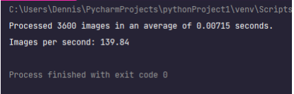
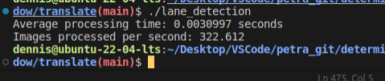

# Python zu C++ Übersetzung

## Motivation und Vorgehen

Die prototypische Python-basierte Ausgangssoftware wurde für eine leistungsfähigere Ausführung in die Programmiersprache C++ transformiert. Um den Übersetzungsprozess zu erleichtern, wurde der ursprüngliche Python-Code vorab optimiert und neu organisiert, was die Lesbarkeit erhöhte. In der folgenden Umsetzung wurden nicht vorhandene Funktionen, wie polyfit und polyval aus der Bibliothek NumPy, durch eigene Funktionen substituiert. Diese Überführung konzentrierte sich primär auf die Leistungssteigerung des Algorithmus, nicht auf die konkrete Umsetzung in C++.

Der Fokus des Projekts lag auf der Leistungsoptimierung, um eine Verarbeitungsgeschwindigkeit von mindestens 15 fps zu erreichen, insbesondere da das Programm auf einem Raspberry Pi mit begrenzter Leistungsfähigkeit laufen soll.

## Optimierungen und Änderungen

1. Eigenimplementation von numpy-Funktionen
Die Python-Bibliothek NumPy wird in einigen Teilen des Codes verwendet, insbesondere die Funktionen polyfit und polyval. Da NumPy in C++ nicht verfügbar ist, wurden eigene Funktionen zur Polynomial-Fitting und -Auswertung implementiert. Die Funktion polyfit wurde implementiert, um Polynomkoeffizienten basierend auf gegebenen Punkten zu berechnen, während evaluate_polynomial ein Polynom mit gegebenen Koeffizienten und einem Wert für x auswertet.

2. Erweiterter Einsatz von OpenCV- und Einbindung der Eigen-Bibliothek
Obwohl OpenCV bereits im ursprünglichen Python-Code genutzt wurde, wurde die Verwendung dieser Bibliothek in der C++-Umsetzung erweitert und optimiert, um die Bildverarbeitung zu verbessern. Darüber hinaus wurde die Eigen-Bibliothek zur Optimierung von Matrixberechnungen in den C++-Code integriert. Diese Bibliotheken bieten effiziente Implementierungen von Bildverarbeitungsalgorithmen und linearen Algebraoperationen.

3. Verwendung von Vektoren anstelle von Numpy-Arrays
In Python wurde die Bibliothek NumPy verwendet, um mit Arrays umzugehen. In C++ wurden stattdessen Vektoren verwendet, da sie eine ähnliche Funktionalität bieten und eine natürlichere Art der Speicherung von Daten darstellen.

4. Effizientere Berechnungen und Verwendung von Eigen
Um die Performance des Codes zu verbessern, wurden effizientere Berechnungsmethoden verwendet. Beispielsweise wurden Schleifen durch Matrixoperationen und Vektorisierung ersetzt, wo es möglich war. Die Eigen-Bibliothek wurde verwendet, um lineare Gleichungssysteme zu lösen und Berechnungen mit Matrizen und Vektoren durchzuführen.

5. Strukturierung des Codes
Der Code wurde in kleinere Funktionen unterteilt, um eine bessere Lesbarkeit und Wiederverwendbarkeit zu gewährleisten. Jede Funktion erfüllt eine spezifische Aufgabe, was die Wartung und Fehlerbehebung erleichtert.

6. Verwendung von std::pair anstelle von Tuples
In Python wurden Tuples verwendet, um Paare von Werten zu speichern. In C++ wurden std::pair verwendet, um die gleiche Funktionalität zu erreichen. Dies verbessert die Lesbarkeit des Codes und erleichtert die Verwendung der Werte.


## Hürden bei der Optimierung und Übersetzung des Codes
Bei der Optimierung und Übersetzung des Codes von Python nach C++ sind einige Herausforderungen aufgetreten, die bewältigt werden mussten. Im Folgenden werden die Hürden beschrieben und erläutert, wie sie gelöst wurden:

### 1. Unterschiede zwischen Python und C++
Python und C++ sind zwei unterschiedliche Programmiersprachen mit verschiedenen Syntaxregeln und Funktionen. Einige Funktionen, die in Python verwendet wurden, wie z.B. numpy.polyfit und numpy.polyval, waren in C++ nicht verfügbar. Daher mussten eigene Funktionen implementiert werden, um diese Lücken zu schließen.

Lösung: Für die Funktionen polyfit und polyval wurden eigene Implementierungen geschrieben, die den gleichen Funktionsumfang wie die entsprechenden NumPy-Funktionen bieten. Dabei wurde die Methode der kleinsten Quadrate verwendet, um die Koeffizienten des Polynoms zu berechnen.

### 2. Unterschiede in Bibliotheken und Datenstrukturen
Der ursprüngliche Python-Code nutzte die Bibliothek "numpy" für numerische Berechnungen und die Datenstruktur "ndarray" für Matrizen und Vektoren. In C++ waren jedoch entsprechende Funktionen und Datenstrukturen nicht standardmäßig verfügbar.

Lösung: Um numerische Berechnungen durchzuführen, wurde die Bibliothek "Eigen" verwendet, die ähnliche Funktionalitäten wie NumPy bietet und numerische Operationen für Matrizen und Vektoren ermöglicht. Die Daten wurden entsprechend in Eigen-Matrizen und -Vektoren umgewandelt, um die Berechnungen durchzuführen.

### 3. Unterschiede in der Array- und Matrixmanipulation
Python bietet eine einfache Syntax für Array- und Matrixmanipulationen, z.B. beim Schneiden von Arrays oder Reduzieren von Matrizen. In C++ sind diese Operationen nicht so einfach durchzuführen und erfordern eine sorgfältige Handhabung der Indizes und Zeiger.

Lösung: Um die Array- und Matrixmanipulationen durchzuführen, wurden die Funktionen der OpenCV-Bibliothek verwendet, die Funktionen zum Schneiden, Reduzieren und Durchführen anderer Operationen auf Matrizen bereitstellt.

### 4. Konvertierung von Python-Funktionen in C++-Funktionen
Ein integraler Teil der Codeoptimierung in diesem Projekt war die Transformation von Python-Funktionen in ihre C++-Äquivalente. Dieser Prozess erforderte ein detailliertes Verständnis der Funktionsweise der ursprünglichen Python-Funktionen und ihrer entsprechenden Implementierung in C++.

Eine Herausforderung in diesem Kontext stellte die Adaption spezifischer Datentypen dar, die von bestimmten Funktionen benötigt wurden. Zum Beispiel war in der Funktion cv2.GaussianBlur aus der Python-Bibliothek OpenCV eine direkte Übergabe der Kernelgröße möglich, während in der entsprechenden C++-Funktion GaussianBlur ein Size-Objekt erforderlich war.

```python
blurred = cv2.GaussianBlur(img, (5, 5), 0)
```

vs.

```cpp
GaussianBlur(img, blurred, Size(5, 5), 0, 0);
```

Diese notwendige Anpassung der Datentypen stellte eine zusätzliche Komplexitätsschicht dar, die bei der Konvertierung der rund 500 Zeilen Python-Code in C++ berücksichtigt werden musste. Trotz der syntaktischen Ähnlichkeiten zwischen Python und C++, waren es diese scheinbar kleinen, aber dennoch bedeutsamen Unterschiede, die einen Großteil des Aufwands im Konvertierungsprozess ausmachten. Jede Funktion musste individuell betrachtet und angepasst werden, um sicherzustellen, dass die funktionalen Anforderungen beider Sprachen erfüllt wurden.

Lösung: Die Funktionen wurden schrittweise analysiert und in C++ übersetzt. Außerdem wurden ähnliche mathematische Berechnungen und Algorithmen verwendet, um das gewünschte Ergebnis zu erzielen. Bei Bedarf wurden auch spezifische C++-Bibliotheken und Funktionen verwendet, um die gewünschte Funktionalität zu erreichen.

### 5. Übertragung von Variablen und Datenstrukturen
Die Übertragung von Variablen und Datenstrukturen von Python nach C++ erforderte eine sorgfältige Handhabung der Typen und Speicherstrukturen. Insbesondere die Konvertierung von Python-Listen und -Tupeln in C++-Vektoren und -Paare erforderte eine angemessene Behandlung.

Lösung: Es wurden geeignete C++-Datenstrukturen wie Vektoren und Paare verwendet, um die entsprechenden Python-Datenstrukturen zu repräsentieren. Dabei wurden die Daten entsprechend konvertiert, um eine genaue Übertragung der Variablen zu ermöglichen.

### 6. Integration von OpenCV und Eigen
Die Integration der OpenCV- und Eigen-Bibliotheken in das C++-Projekt erforderte die richtige Konfiguration und Verlinkung der Bibliotheken, um sicherzustellen, dass sie korrekt verwendet werden können.

Lösung: Die erforderlichen Header-Dateien und Bibliotheken wurden in den Build-Prozess integriert und entsprechend konfiguriert, um sicherzustellen, dass sie im Code korrekt verwendet werden können. Die CMake-Dateien oder das Build-System des Projekts wurden entsprechend aktualisiert, um die erforderlichen Abhängigkeiten und Verlinkungen zu berücksichtigen.

## Fazit

Durch das Lösen dieser Hürden und die entsprechenden Anpassungen konnte der Python-Code erfolgreich in C++ übersetzt und optimiert werden. Die resultierende C++-Implementierung bietet eine deutlich erhöhte Verarbeitungsgeschwindigkeit im Vergleich zur ursprünglichen Python-Version.

  <table>
    <tr>
      <td>  </td>
      <td>  </td>
    </tr>
  </table>

  *Speedtest Python vs. optimierter C++ Code*